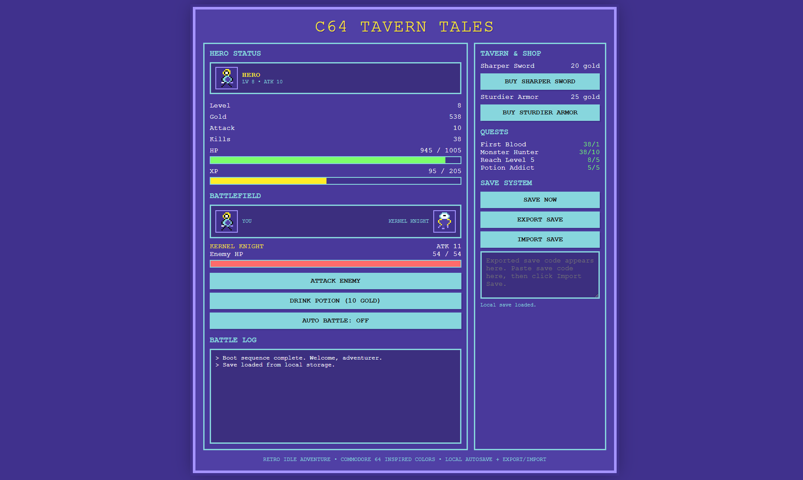

# C64 Tavern Tales

Single-file **web app**. C64-styled **idle RPG** you run by opening the HTML.

## Live site

## How to play

- Open `c64_tavern_tales.html` in a modern browser (Chrome / Edge / Firefox).
- Click **Attack Enemy** to fight.
- Use **Drink Potion (10 gold)** to heal.
- Toggle **Auto Battle** to fight automatically.

## Features

- **Click + idle progression** (gold trickle + small regen over time)
- **Auto-battle toggle**
- **Leveling** (XP → level ups → more HP/ATK)
- **Shop upgrades** (weapon/armor scaling costs)
- **Simple quests** (kill/level/potion milestones)
- **Saves**
  - Local autosave (localStorage)
  - Export/import save code (copy/paste)

## Save data notes

- Local save key: `c64IdleRpgSave_v1`
- Export format: base64-encoded JSON

## Project layout

- `c64_tavern_tales.html`: all HTML/CSS/JS in one file

## License

MIT (see `LICENSE`).
